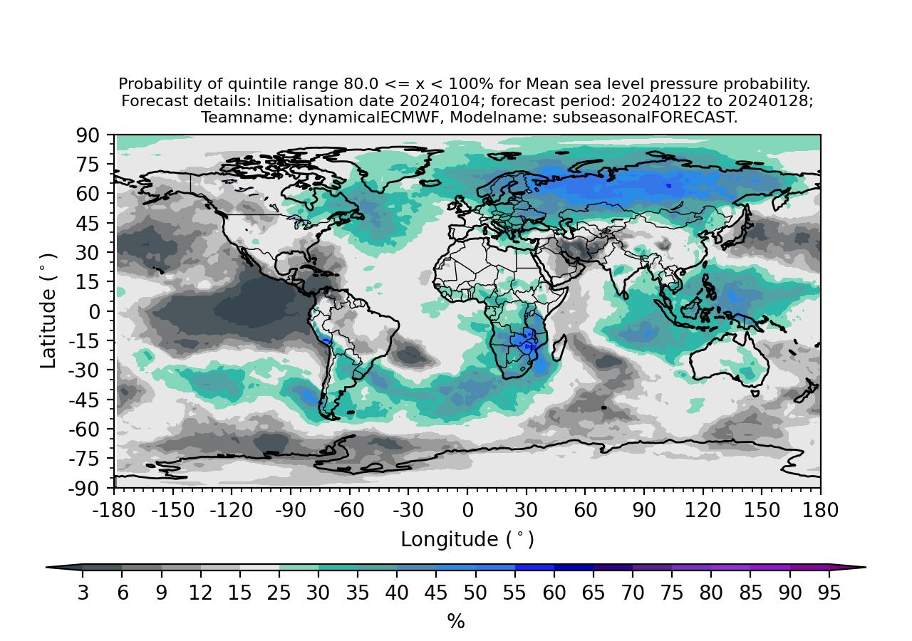

Forecast Plotting
====================================

Importing the Forecast Plotting Module
----------------------------------------

To help participants visualize their sub-seasonal forecasts, the *AI-WQ-Package* includes a dedicated module called **plotting_forecast**. This module allows you to easily plot Quest-compatiable forecasts.

To import the necessary plotting function, use:

.. code-block:: python

  from AI_WQ_package import plotting_forecast

Plotting a forecast
---------------------------------------

The ``plotting_forecast`` module provides a set of high-level plotting functions designed to visualise forecasts contributed to the AI Weather Quest. These functions generate figures that are consistent with the format and styling used on the AI Weather Quest forecast portal.

The module includes three overarching plotting functions:

1. **plot_forecast**  
   Generates a spatial map displaying probabilistic forecasts for a specified quantile range.

2. **plot_TS_forecast**  
   Produces a map showing tercile-based forecast probabilities for the number of tropical storm days across each active ocean basin. 

3. **plot_MJO_forecast**  
   Creates a collection of Wheeler–Hendon phase-space diagrams illustrating forecasted probabilities for each phase of the Madden–Julian Oscillation (MJO). 

All three functions generate figures that match the visual standards, colour schemes, and layout conventions of the AI Weather Quest forecast portal, ensuring consistency between locally generated outputs and publicly displayed forecasts.

1. Plotting quintile-based probabilistic forecasts
^^^^^^^^^^^^^^^^^^^^^^^^^^^^^^^^^^^^^^^^

The *plot_forecast* function generates a map showing the probability forecast for a given quantile range. 

The *plot_forecast* function only has three inputs:

.. code-block:: python

  plot_forecast(<<forecast>>,<<quintile_num>>,local_destination=None)

- **forecast** (*xarray.dataarray*): Your submitted forecast to the AI Weather Quest.
- **quintile_num** (*int* or *str*): The selected quintile where 1 refers to  < 20%, 2 refers to 20 <= x < 40% etc.
- **local_destination** (*str*, optional): Path to the local folder where the figure will be saved. If not provided, the figure will be saved in the current working directory.

The figure filename is automatically created using forecast attributes. The format is:

.. code-block:: python
    
    <<variable>>_<<fc_init_date}>>_p<<fcwin>>_<<teamname>>_<<modelname>>_quintile_<<quintile_value>>.jpg

where:

- **variable**: Forecasted variable (e.g. tas, mslp or pr).
- **fc_init_date**: Forecast initialisation date in format *YYYYMMDD* (e.g. 20250403).
- **fcwin**: The sub-seasonal forecasting window (either '1' or '2').
- **teamname**: The teamname associated with the submitted forecast.
- **modelname**: The modelname associated with the submitted forecast.
- **quintile_value**: Upper limit of the selected quintile (e.g. 20, 40 etc.)

.. note::  
   
   The *plot_forecast* function only works with dataarray templates provided through the *AI-WQ-package*.

Example Usage
""""""""""""""""""""""""""""""""""""""""

Here is how you might use the function to generate a forecast plot for the 60–80% quintile range:

.. code-block:: python

  from AI_WQ_package.plotting_forecast import plot_forecast
  
  # Plot the 4th quintile (60 to 80%) and save to a local folder ('/home/test_figures/')
  plot_forecast(submitted_forecast,4,local_destination='/home/test_figures/'

Below is an example forecast figure showing predicted probabilities of mean sea level pressure being between 80.0 and 100.0% of climatological conditions for the week commencing 22nd January 2024. The forecast was initialised on the 4th January 2024 and based on ECMWF dynamical sub-seasonal forecasts.

2. Plotting tercile-based probabilities of tropical storm days
^^^^^^^^^^^^^^^^^^^^^^^^^^^^^^^^^^^^^^^^^^^^^^^^^^^^^^^^^^^

The *plot_TS_forecast* function generates a global map showing tercile-based probabilistic forecasts for the number of tropical storm days in each active basin.

The function displays forecast probabilities using coloured bars within predefined ocean basin regions. Basins that are seasonally inactive during the forecast period are highlighted using a greyed-out box labelled *Inactive*.

The *plot_TS_forecast* function has two inputs:

.. code-block:: python

   plot_TS_forecast(<<forecast>>, local_destination=None)

- **forecast** (*xarray.DataArray*):  
  A submitted tropical storm forecast following the AI Weather Quest data template.  
  The data are expected to represent tercile-based probabilities for each basin.

- **local_destination** (*str*, optional):  
  Path to the local directory where the generated figure will be saved.  
  If not provided, the figure is saved in the current working directory.

The figure filename is automatically generated using metadata extracted from the forecast object and follows the format:

.. code-block:: python

   TS_<<fc_init_date>>_p<<fcwin>>_<<teamname>>_<<modelname>>.jpg

where:

- **fc_init_date**: Forecast initialisation date in *YYYYMMDD* format.
- **fcwin**: The sub-seasonal forecasting window (either '1' or '2').
- **teamname**: Team name associated with the submitted forecast.
- **modelname**: Model name associated with the submitted forecast.

The colour scale represents tercile probabilities expressed as percentages, and the map extent is restricted to latitudes between 50°S and 50°N. Seasonal basin activity is handled automatically based on competitive period.

.. note::

   The *plot_TS_forecast* function only works with tropical storm forecast files provided through the *AI-WQ-Package* and assumes basin definitions consistent with the AI Weather Quest training data.

Example Usage
""""""""""""""""""""""""""""""""""""""""

The following example demonstrates how to generate and save a tropical storm probability forecast map:

.. code-block:: python

   from AI_WQ_package.plotting_forecast import plot_TS_forecast

   # Plot tercile-based tropical storm probabilities
   plot_TS_forecast(submitted_TS_forecast,
                    local_destination="/home/test_figures/")

Below is an example figure showing tercile-based probabilities of tropical storm days for each active basin during the forecast period. The forecast was initialised on 4 January 2024 and corresponds to ECMWF dynamical sub-seasonal predictions.

3. Plotting MJO phase probabilities
^^^^^^^^^^^^^^^^^^^^^^^^^^^^^^^^

The *plot_MJO_forecast* function generates a figure with multiple Wheeler–Hendon phase-space diagram showing probabilistic forecasts for each phase of the MJO.

Each panel represents a different forecast lead time and displays the probability (%) of the MJO occupying each of the eight standard phases, along with the probability of an inactive MJO state. Phase probabilities are visualised using shaded sectors coloured according to a predefined probability colour scale.

The *plot_MJO_forecast* function has two inputs:

.. code-block:: python

   plot_MJO_forecast(<<forecast>>, local_destination=None)

- **forecast** (*xarray.DataArray*):  
  A submitted MJO forecast following the AI Weather Quest data template.  
  The array is expected to contain probabilistic values for MJO phases 1 to 8 and the inactive state, for multiple forecast lead times.

- **local_destination** (*str*, optional):  
  Path to the local directory where the generated figure will be saved.  
  If not provided, the figure is saved in the current working directory.

The figure filename is automatically generated using forecast metadata and follows the format:

.. code-block:: python

   MJO_<<fc_init_date>>_<<teamname>>_<<modelname>>.jpg

where:

- **fc_init_date**: Forecast initialisation date in *YYYYMMDD* format.
- **teamname**: Team name associated with the submitted forecast.
- **modelname**: Model name associated with the submitted forecast.

The colour bar represents phase probabilities expressed as percentages. The inactive MJO state is shown as a central circular region, while active phases are displayed as sector-shaped regions following the standard Wheeler–Hendon phase definition.

Panel titles indicate both the forecast lead time (in days) and the valid date for each forecast.

.. note::

   The *plot_MJO_forecast* function only works with MJO forecast files provided through the *AI-WQ-Package* and assumes a standard eight-phase Wheeler–Hendon MJO definition.

Example Usage
""""""""""""""""""""""""""""""""""""""""

The following example demonstrates how to generate and save an MJO phase probability forecast figure:

.. code-block:: python

   from AI_WQ_package.plotting_forecast import plot_MJO_forecast

   # Plot MJO phase probabilities and save to a local directory
   plot_MJO_forecast(submitted_MJO_forecast,
                     local_destination="/home/test_figures/")

Below is an example figure showing forecast probabilities for each MJO phase at multiple lead times. The forecast was initialised on 4 January 2024 and is based on ECMWF dynamical sub-seasonal predictions.

